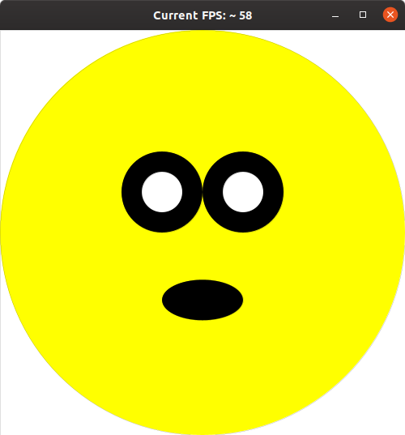
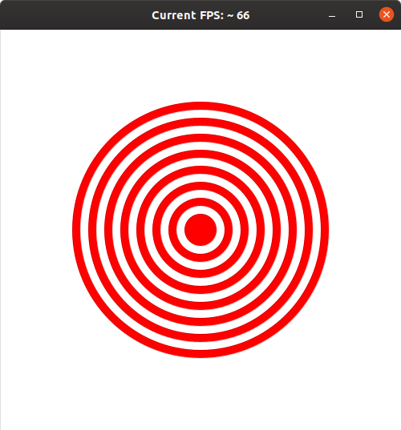
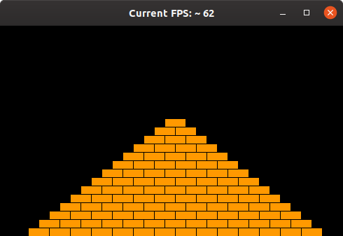
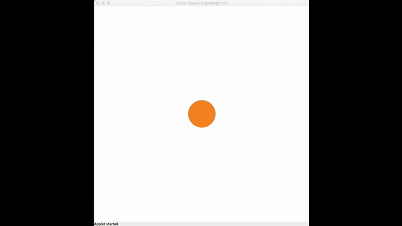

# Übungsblatt 3

## Wichtige Informationen zur Bearbeitung der Aufgabe 
 - [Informationen zur Entwicklungsumgebung *IntelliJ IDEA*](https://regensburger-forscher.de/oop/tutorials/Entwicklungsumgebung)
 - [Informationen zum Im- und Export von Projekten](https://regensburger-forscher.de/oop/tutorials/Starterprojekte)
 - [GraphicsApp](https://elearning.uni-regensburg.de/mod/url/view.php?id=1482162)

## Starterpaket

Ein vorbereitetes Starterpaket zur selbständigen Implementierung der Aufgabe finden Sie [hier](https://github.com/OOP-Regensburg/GraphicsApp-Exercise-03/archive/Starterpaket.zip).

## **Hello GraphicsApp**

In dieser Aufgabe können Sie erste Erfahrungen mit der GraphicsApp sammeln. Zeichnen Sie einen überraschten Smiley, wie in der folgenden Abbildung dargestellt.

- Ihr Programm startet in der Methode `public void initalize()`. Das Zeichnen des Gesichts soll in der Methode `draw` druchgeführt werden.

- Zerlegen Sie das Problem in Teilprobleme und erstellen zuerst die Aufrufe für die Methoden `setupCanvas()` und `drawSmiley()` in den vorhandenen Methoden `initalize()` und `draw()`.

- Fügen Sie dann die Methoden in der Graphics-App hinzu und setzen Sie in `setupCanvas()` dort die Hintergrundfarbe und die Breite und Höhe der Zeichenflächeauf 500 Pixel.

- Der Smiley muss zentriert auf der Zeichenfläche dargestellt werden, unabhängig von der Größe des Zeichenfelds! Verwenden Sie geeignete Konstanten (vgl. Beispielcode aus der Vorlesung), um die Breite und Höhe an einer einzigen Stelle in Ihrem Programm zu definieren. Alle anderen Stellen, an denen diese Werte gebraucht werden müssen sich auf diese zentrale Stelle beziehen!

- Die Größe des Smileys können Sie frei wählen.

- Nutzen Sie zum Zeichnen des Smiley bzw. den einzelnen Teilen des Gesichts Ellipsen mit unterschiedlicher Größe, Farbe und Position.

## **Zielscheibe**

In dieser Aufgabe sollen Sie eine Zielscheibe auf dem Bildschirm
zeichnen:

Die Zielscheibe muss aus 15 Ellipse-Objekten bestehen und im Zentrum des Bildschirms gezeichnet werden. Der mittlere Ring ist rot und hat einen Durchmesser von 10, die Farben wechseln sich dann nach außen hin ab. Der Durchmesser jedes weiteren Rings entspricht dem seines Vorgängers, erhöht um den Durchmesser des ersten Rings.  Legen Sie für die Anzahl der Ringe und den Durchmesser des innersten Rings geeignete Konstanten an, und testen Sie, ob Ihr Programm auch mit anderen Werten einwandfrei funktioniert. Legen Sie weitere Konstanten an, um Ihren Code robuster gegen Veränderungen zu machen.

**Tipp:** Die Ringe werden übereinander gezeichnet, d.h. Sie müssen mit dem äußersten Ring anfangen, um zu vermeiden, dass die kleineren Ringe verdeckt werden.

## **Pyramide**

**Klasse im Starterpaket:** `Pyramid`

Ihr Programm soll eine Pyramide zeichnen, die aus einzelnen Ziegeln besteht, die in horizontalen Linien angeordnet werden. Die Anzahl der einzelnen Blöcke nimmt um einen Block pro Reihe ab:

Die Pyramide soll am unteren Ende der Zeichenfläche stehen und in der Mitte zentriert werden. Verwenden Sie mindestens die folgenden Konstanten:

- `BRICK_WIDTH` für die Breite der Ziegel (30).

- `BRICK_HEIGHT` für die Höhe der Ziegel (12).

- `BRICKS_IN_BASE` für die Anzahl der Ziegel der untersten Reihe (14).

Die angegebenen Zahlen entsprechen der Pyramide auf dem Screenshot, aber Ihre Pyramide muss für unterschiedliche Werte korrekt funktionieren.

**Tipp zur Herangehensweise:** Versuchen Sie zuerst, einen Stapel aus einzelnen Ziegeln zu erzeugen. Modifizieren Sie diesen Code dann, um
eine Wand zu erzeugen (und denken Sie daran, die *Decomposition*-Methode anzuwenden). Anschließend modifizieren Sie diesen Code, so dass in jeder Reihe ein Ziegel mehr bzw. weniger gesetzt wird (je nachdem, ob Sie die Pyramide von oben oder von unten bauen). Zum Schluss müssen die einzelnen Ziegelreihen noch zentriert werden, d.h. Sie müssen den passenden Startpunkt für jede Reihe berechnen.

## **Expanding Circle**

**Klasse im Starterpaket:** `ExpandingCircle`

Schreiben Sie ein Programm auf der Basis der GraphicsApp, das einen wachsenden Kreis animiert. In der Mitte der Zeichenfläche wird eine Ellipse dargestellt, die mit jedem Aufruf der `draw`-Methode um `1px` in beide Dimensionen wächst. Nutzen Sie zur Animation das Muster, das in
der Vorlesung im Rahmen des *draw loops* vorgestellt wurde.

Definieren Sie in Ihrem Programm zwei Konstanten für einen initialen (`50px`) sowie einen maximalen Radius (`250px`) für die Ellipse. Sobald der maximale Wert erreicht ist, wird die Ellipse auf die ursprüngliche Größe zurückgesetzt. Die Animation `[initialer Radius -> maximaler Radius]` soll sich endlos wiederholen.

